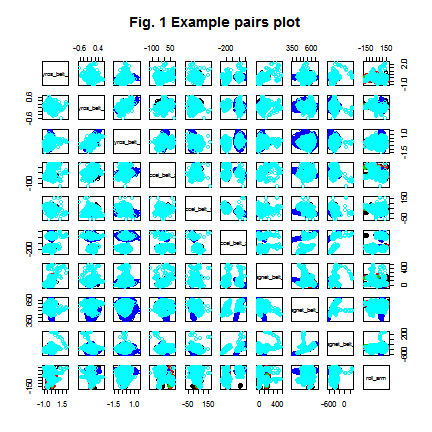
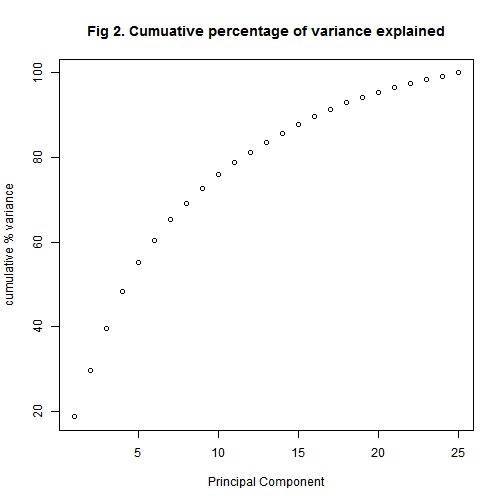
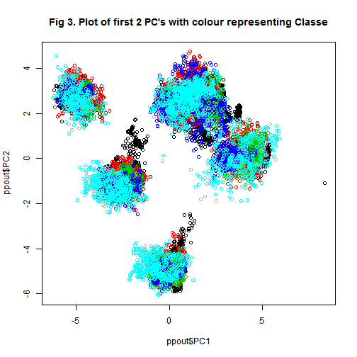
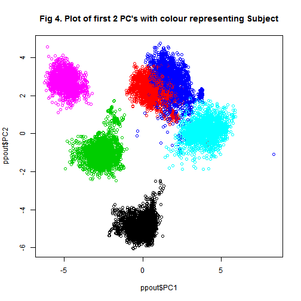

##Introduction

Human Activity Recognition (HAR) has emerged as a key research area in the last few years and is gaining increasing attention.  There are many potential applications for HAR, like: elderly monitoring, life log systems for monitoring energy expenditure and for supporting weight-loss programs, and digital assistants for weight lifting exercises. One thing that people regularly do is quantify how much of a particular activity they do, but they rarely quantify how well they do it.  The approach used here with the Weight Lifting Exercises dataset is to investigate "how (well)" an activity was performed by the wearer. Six young health participants were asked to perform one set of 10 repetitions of the Unilateral Dumbbell Biceps Curl in five different fashions: exactly according to the specification (Class A), throwing the elbows to the front (Class B), lifting the dumbbell only halfway (Class C), lowering the dumbbell only halfway (Class D) and throwing the hips to the front (Class E) (see *http://groupware.les.inf.puc-rio.br/har*).Class A corresponds to the specified execution of the exercise, while the other 4 classes correspond to common mistakes. In this project, the goal will be to use data from accelerometers on the belt, forearm, arm, and dumbell of 6 participants and associated data to predict the manner in which they did the exercise.

##Methods, Data Processing & Exploratory Data Analysis

There were two data sets provided:*pml-training.csv* and *pml-testing.csv*. As stated above, the goal of the project is to predict the manner in which they did the exercise and this is the **classe** variable in the training set. The pml-training data set was used to select the model, cross-validate and a validation subset of data was used to estimate the out of sample error for the finally selected model.  The pml-testing data was used with the final selected model to predict 20 test cases for the purpose of the course project.

The training data set was read in and using the *caret* package, was randomly split into a training (**train**) and validation (**valid**) data set in an approx 70% to 30% ratio.


```r
##ensure working directory is set to where the data is
###load required libraries - assume they are installed if necessary

library(plyr)
library(caret)
library(randomForest)
set.seed(543)
data<- read.csv("pml-training.csv", header=TRUE)
testing<-read.csv("pml-testing.csv",header=TRUE)


inTrain <- createDataPartition(y=data$classe,p=0.7, list=FALSE)

train <- data[inTrain,]
valid <- data[-inTrain,]
dim(train);dim(valid)
```

```
## [1] 13737   160
```

```
## [1] 5885  160
```

```r
table(train$classe)
```

```
## 
##    A    B    C    D    E 
## 3906 2658 2396 2252 2525
```

```r
head (names(train),20)
```

```
##  [1] "X"                    "user_name"            "raw_timestamp_part_1"
##  [4] "raw_timestamp_part_2" "cvtd_timestamp"       "new_window"          
##  [7] "num_window"           "roll_belt"            "pitch_belt"          
## [10] "yaw_belt"             "total_accel_belt"     "kurtosis_roll_belt"  
## [13] "kurtosis_picth_belt"  "kurtosis_yaw_belt"    "skewness_roll_belt"  
## [16] "skewness_roll_belt.1" "skewness_yaw_belt"    "max_roll_belt"       
## [19] "max_picth_belt"       "max_yaw_belt"
```

```r
#summary(train)
s<-c(12,18)
summary (train[,s])
```

```
##  kurtosis_roll_belt max_roll_belt    
##           :13447    Min.   :-94.300  
##  #DIV/0!  :    8    1st Qu.:-87.975  
##  -0.016850:    1    Median : -4.600  
##  -0.034743:    1    Mean   : -2.433  
##  -0.060160:    1    3rd Qu.: 20.075  
##  -0.080411:    1    Max.   :180.000  
##  (Other)  :  278    NA's   :13447
```

As can be seen from the dimension statements there were 13,737 observations in the training dataset and 5,885 observations in the validation dataset.  The validation dataset was set aside and only used to estimate the out of sample error (see below).

There were 160 variables in the training data set (20 of the names are listed as an example). Initially a summary of all the 160 variables was examined ((using the *summary* function - output too large for this report).  It was clear that there were a substantial number of variables **all** with either the same number of *NA*'s or *blank* values. Two examples are given above. In this case the number is identical across a large number of variables - either 13,447 NA values or 13,447 blank values. It was decided that these variables provided too little information to be of use in any classification model - so the next step was to identify and remove them.  Of course the training data set could vary in it's numbers each time we run the selection - so to generalize we used one of the variables to ensure that we found this number each time (**xmiss**).


```r
### Find variables that have "xmiss" no of values blank or NA
xmiss<-sum(is.na(train$max_roll_belt))
miss<-rep(0,ncol(train))
miss<-as.integer(miss)
for (i in 1:ncol(train)) {
               if (sum(is.na(train[,i]))==xmiss) miss[i]<-1
        }

#table(miss)
blank<-rep(0,ncol(train))
blank<-as.integer(blank)

for (i in 1:ncol(train)) {
        y<- count(train[,i]=="")       
        x<-dim(y)
                if (x[1]==1) next
                if (y[2,2]==xmiss) blank[i]<-1            
}
#table(blank)
table (miss, blank)
```

```
##     blank
## miss  0  1
##    0 60 33
##    1  0 67
```

```r
allmiss<-rep(0,ncol(train))
allmiss<-as.integer(allmiss)
for (i in 1:ncol(train)) {
        if((miss[i]==1)|(blank[i]==1)) allmiss[i]<-1
}

table(allmiss)
```

```
## allmiss
##   0   1 
##  60 100
```

```r
trainvar<- train[,allmiss==0]
trainvar<- trainvar[,-1]
names(trainvar)
```

```
##  [1] "user_name"            "raw_timestamp_part_1" "raw_timestamp_part_2"
##  [4] "cvtd_timestamp"       "new_window"           "num_window"          
##  [7] "roll_belt"            "pitch_belt"           "yaw_belt"            
## [10] "total_accel_belt"     "gyros_belt_x"         "gyros_belt_y"        
## [13] "gyros_belt_z"         "accel_belt_x"         "accel_belt_y"        
## [16] "accel_belt_z"         "magnet_belt_x"        "magnet_belt_y"       
## [19] "magnet_belt_z"        "roll_arm"             "pitch_arm"           
## [22] "yaw_arm"              "total_accel_arm"      "gyros_arm_x"         
## [25] "gyros_arm_y"          "gyros_arm_z"          "accel_arm_x"         
## [28] "accel_arm_y"          "accel_arm_z"          "magnet_arm_x"        
## [31] "magnet_arm_y"         "magnet_arm_z"         "roll_dumbbell"       
## [34] "pitch_dumbbell"       "yaw_dumbbell"         "total_accel_dumbbell"
## [37] "gyros_dumbbell_x"     "gyros_dumbbell_y"     "gyros_dumbbell_z"    
## [40] "accel_dumbbell_x"     "accel_dumbbell_y"     "accel_dumbbell_z"    
## [43] "magnet_dumbbell_x"    "magnet_dumbbell_y"    "magnet_dumbbell_z"   
## [46] "roll_forearm"         "pitch_forearm"        "yaw_forearm"         
## [49] "total_accel_forearm"  "gyros_forearm_x"      "gyros_forearm_y"     
## [52] "gyros_forearm_z"      "accel_forearm_x"      "accel_forearm_y"     
## [55] "accel_forearm_z"      "magnet_forearm_x"     "magnet_forearm_y"    
## [58] "magnet_forearm_z"     "classe"
```

```r
##exploratory sample code - commented out so as not give too much output

# 
# for (i in 6:58) {
#         hist(trainvar[,i])
# }
# plot(trainvar$roll_belt,trainvar$pitch_belt,col=trainvar$classe)

# 
# ###pairwise plots
# 

 l1<-1:5;l2<-6:10;l3 <-11:20
 pairs(trainvar[,l3],main="Fig. 1 Example pairs plot",col=trainvar$classe)
```

 

There were 67 variables with large numbers (13,447) of NA values and 60 variables with a large (common) number of blank values.  The crosstab of the variables **miss** and **blank** show the distribution, and the table of the variable **allmiss** shows that there were 60 variables remaining that had sufficient data to be included in the analysis.  Finally the first variable **X** which was an index variable was also eliminated.  That left 59 variables that remained in the analysis training data set **trainvar** and the names of these are given above.

Each of these variables were plotted and examined (with histograms and pairwise plots).  Some were clearly bimodal and some slightly skewed - but generally it was decided to leave them untransformed. Figure 1 is an example plot.

To see if we could reduce the data set even further a principal components analysis was undertaken (using the *preprocess* function in caret).


```r
### principal component analysis        
        
pp<-preProcess(trainvar[,-59],method="pca")
ppout<-predict(pp,trainvar[,-59])
pp
```

```
## Created from 13737 samples and 58 variables
## 
## Pre-processing:
##   - centered (55)
##   - ignored (3)
##   - principal component signal extraction (55)
##   - scaled (55)
## 
## PCA needed 26 components to capture 95 percent of the variance
```

```r
totvarpc<-0
varpc<-rep(0,ncol(ppout))
for (i in 5:ncol(ppout)){
        varpc[i]<-var(ppout[,i])
        totvarpc<-totvarpc+varpc[i]
}
#totvarpc
varpc<-varpc[-(1:4)]
varpcperc<-(varpc/totvarpc)*100
x<-1:length(varpcperc)
#plot(x,varpcperc)
cumperc<-rep(0,length(varpcperc))
cumperc[1]<-varpcperc[1]
for (j in 2:length(varpcperc)){
        cumperc[j]<-varpcperc[j]+cumperc[j-1]
}
plot(x,cumperc,main="Fig 2. Cumuative percentage of variance explained",ylab="cumulative % variance", xlab="Principal Component")
```

 

```r
plot(ppout$PC1,ppout$PC2, col=trainvar$classe, main="Fig 3. Plot of first 2 PC's with colour representing Classe")
```

 

```r
plot(ppout$PC1,ppout$PC2, col=trainvar$user_name,main="Fig 4. Plot of first 2 PC's with colour representing Subject")
```

 

As can be seen, 26 components captured 95% of the variability. The cumulative percentage explained by each PC was calculated and then plotted (Fig. 2).  As can be seen the first two principal components account for about 20% of the variability and the first 6 for about 60%. Plotting against the first 2 components in some way is the "best" 2 dimensional plot of the variability in this data.  Several plots were examined, but two are shown here. Fig. 3 shows the **classe** variable and Fig. 4 the subject plotted against the first two PCs.  In the first it is clear from the colours that the classe variable is overlaps in all cases - so these two components are not good at distinguishing how well a person did.  However, the PC plot by subject shows a very clear division by the 6 individuals.  It is clear we could reduce dimensionality to these 2 PCs if we wanted to predict who the subject was based on these data!  In any case given the significant reduction in number of variables, it was decided to use the principal components in one of the analyses.

Three different models were built try and predict the manner in which the participants did the exercise - the **classe** variable.  First a linear discriminant analysis was used using the original 58 selected variables (excluding *classe*) (method="lda" in caret). Secondly we used linear discriminant analysis using the principal components. Finally we built a random forest model using the untransformed 58 variables (method="rf" in caret).  For the two lda models we used 10 fold cross-validation repeated 10 times.  The random forest algorithm uses 25 bootstrap resamplings for it's cross validation.  The resulting output from each model was examined and a final model selection was made.  This was used on the **valid** validation data set to get the out of sample estimate of error.

##Results
###Linear Discriminant Analysis with original 58 selected variables


```r
###Model fitting

###lda with original variables
fitControl <- trainControl(method = "repeatedcv",number = 10,repeats = 10) ##k-fold repeat cv
set.seed(346)
modlda = train(trainvar$classe ~ .,method="lda", data=trainvar,trControl = fitControl)
modlda
```

```
## Linear Discriminant Analysis 
## 
## 13737 samples
##    58 predictor
##     5 classes: 'A', 'B', 'C', 'D', 'E' 
## 
## No pre-processing
## Resampling: Cross-Validated (10 fold, repeated 10 times) 
## Summary of sample sizes: 12362, 12363, 12364, 12364, 12361, 12364, ... 
## Resampling results
## 
##   Accuracy   Kappa      Accuracy SD  Kappa SD  
##   0.8560756  0.8180791  0.008063017  0.01018762
## 
## 
```

```r
predlda1<-predict(modlda,trainvar)
conf<-table(predlda1,trainvar$classe)
print ("Confusion Matrix");conf
```

```
## [1] "Confusion Matrix"
```

```
##         
## predlda1    A    B    C    D    E
##        A 3554  316    4    0    0
##        B  307 1973  227    1    0
##        C   45  353 2086  220   11
##        D    0   16   74 1894  218
##        E    0    0    5  137 2296
```

```r
totclasse<-table(trainvar$classe)

percorrect<-rep(0,5)
for (i in 1:5){
        percorrect[i]<-((conf[i,i]/totclasse[i])*100)
}
print("Percent correct for each category");percorrect
```

```
## [1] "Percent correct for each category"
```

```
## [1] 90.98822 74.22874 87.06177 84.10302 90.93069
```

As can be seen there was about 86% accuracy and a kappa of 0.81 - which is reasonable (for a good discussion of Kappa see *http://stats.stackexchange.com/questions/82162/kappa-statistic-in-plain-english*.  Though the accuracy is good, as can be seen from the confusion matrix (and the kappa) for classe B there was an accuracy rate under 75% - which is not every good, and for classe D it was 84%.

###Linear Discriminant Analysis with principal components

Here we used the 26 principal components we generated in the earlier pre-processing step in a linear discriminant analysis. Again for cross validation we used k-fold repeat cv with 10 folds and 10 repeats.


```r
###lda with principal components
fitControlpc <- trainControl(method = "repeatedcv",number = 10,repeats = 10)
set.seed(346)
modldapc = train(trainvar$classe ~ .,method="lda", data=ppout, trControl = fitControlpc)
modldapc
```

```
## Linear Discriminant Analysis 
## 
## 13737 samples
##    28 predictor
##     5 classes: 'A', 'B', 'C', 'D', 'E' 
## 
## No pre-processing
## Resampling: Cross-Validated (10 fold, repeated 10 times) 
## Summary of sample sizes: 12362, 12363, 12364, 12364, 12361, 12364, ... 
## Resampling results
## 
##   Accuracy   Kappa      Accuracy SD  Kappa SD  
##   0.7537246  0.6896194  0.0102709    0.01288966
## 
## 
```

```r
predlda2<-predict(modldapc,ppout)
conf2<-table(predlda2,trainvar$classe)
print ("Confusion Matrix");conf2
```

```
## [1] "Confusion Matrix"
```

```
##         
## predlda2    A    B    C    D    E
##        A 3256  282    2    0    0
##        B  427 1772  415   68    0
##        C  223  588 1799  304   27
##        D    0   16  175 1500  444
##        E    0    0    5  380 2054
```

```r
totclasse<-table(trainvar$classe)

percorrect<-rep(0,5)
for (i in 1:5){
        percorrect[i]<-((conf2[i,i]/totclasse[i])*100)
}
print("Percent correct for each category");percorrect
```

```
## [1] "Percent correct for each category"
```

```
## [1] 83.35893 66.66667 75.08347 66.60746 81.34653
```

The results from the lda using the principal components was disappointing.  The accuracy was only 75% with a Kappa of 69%.  The confusion matrix showed that several categories had particularly poor prediction - 67% for Classe B and D.

### Random Forest 

The final model tried was a random forests classification model.  The model was trained using the training dataset with the 58 variables described above, using the caret package.  The model cross validates using bootstrapping and 25 repetitions to to tune the parameters and end up with a final model.


```r
###random forest

modFit <- train(trainvar$classe ~ .,data=trainvar,method="rf")

modFit
```

```
## Random Forest 
## 
## 13737 samples
##    58 predictor
##     5 classes: 'A', 'B', 'C', 'D', 'E' 
## 
## No pre-processing
## Resampling: Bootstrapped (25 reps) 
## Summary of sample sizes: 13737, 13737, 13737, 13737, 13737, 13737, ... 
## Resampling results across tuning parameters:
## 
##   mtry  Accuracy   Kappa      Accuracy SD   Kappa SD    
##    2    0.9866756  0.9831402  0.0016191744  0.0020573247
##   41    0.9984800  0.9980772  0.0007089598  0.0008969758
##   80    0.9972550  0.9965280  0.0011695029  0.0014774521
## 
## Accuracy was used to select the optimal model using  the largest value.
## The final value used for the model was mtry = 41.
```

```r
predrf<-predict(modFit,trainvar)
print("Confusion Matrix")
```

```
## [1] "Confusion Matrix"
```

```r
table(predrf,trainvar$classe)
```

```
##       
## predrf    A    B    C    D    E
##      A 3906    0    0    0    0
##      B    0 2658    0    0    0
##      C    0    0 2396    0    0
##      D    0    0    0 2252    0
##      E    0    0    0    0 2525
```

The best model was with an mtry (number of random variables used in each tree) of 41.  This model performed very well with an accuracy of 99.8% and a kappa of 0.998. This can be seen in the confusion matrix. 

This was the best performing model by far so was chosen as the final model.  Clearly there is a risk of over fitting so the next step was to look at out of sample error using the validation data set.

### Out of sample error

To estimate the out of sample error we used the validation data set **valid** generated above.  We apply the model trained on the training set to see how good it performs in the validation data set.  This is a one off - the validation data set has not been touched or used in training the models - so gives a good estimate of out of sample error.


```r
###
###Out of sample error
###

pred <- predict(modFit,valid)
testpred<-table(pred,valid$classe)
#testpred
confusionMatrix(testpred)
```

```
## Confusion Matrix and Statistics
## 
##     
## pred    A    B    C    D    E
##    A 1674    0    0    0    0
##    B    0 1139    1    0    0
##    C    0    0 1025    3    0
##    D    0    0    0  960    0
##    E    0    0    0    1 1082
## 
## Overall Statistics
##                                          
##                Accuracy : 0.9992         
##                  95% CI : (0.998, 0.9997)
##     No Information Rate : 0.2845         
##     P-Value [Acc > NIR] : < 2.2e-16      
##                                          
##                   Kappa : 0.9989         
##  Mcnemar's Test P-Value : NA             
## 
## Statistics by Class:
## 
##                      Class: A Class: B Class: C Class: D Class: E
## Sensitivity            1.0000   1.0000   0.9990   0.9959   1.0000
## Specificity            1.0000   0.9998   0.9994   1.0000   0.9998
## Pos Pred Value         1.0000   0.9991   0.9971   1.0000   0.9991
## Neg Pred Value         1.0000   1.0000   0.9998   0.9992   1.0000
## Prevalence             0.2845   0.1935   0.1743   0.1638   0.1839
## Detection Rate         0.2845   0.1935   0.1742   0.1631   0.1839
## Detection Prevalence   0.2845   0.1937   0.1747   0.1631   0.1840
## Balanced Accuracy      1.0000   0.9999   0.9992   0.9979   0.9999
```

As can be seen, the model predicted all but 5 data points correctly (from a total of 5885 observations). This gave an accuracy of 99.9% (a CI is given above).  Kappa was 0.9985.  So the evidence indicates that this is not over fitted and that it is highly successful at predicting **classe** in this sample and that the out of sample error is low.

### Prediction Assignment

Part of the assignment was to predict the values for **classe** from a testing data set *pml-testing.csv* using the final model selected. There was no "correct" data - so no way of checking accuracy etc.  


```r
##prediction for the testing data set provided

##use model to predict from testing dataset
predtest <- predict(modFit,testing)
predtest ##lists out classification
```

```
##  [1] B A B A A E D B A A B C B A E E A B B B
## Levels: A B C D E
```
The variable **predtest** shows the classification on the 20 data points. These were submitted through the coursera practical machine learning course website and the resulting classifications were seen to be correct in all 20 cases - showing again that the model seems to work extremely well.


